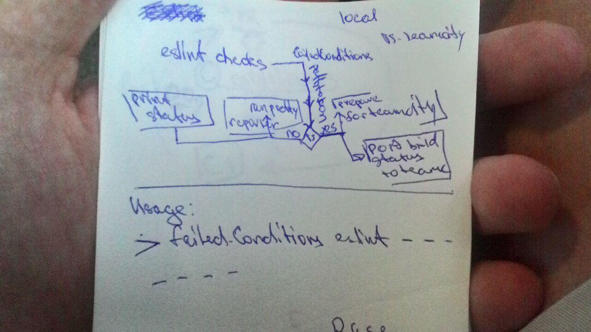
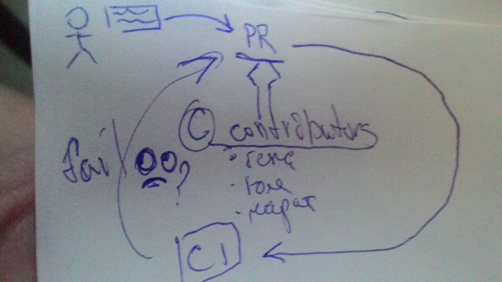

# advanced build conditions
Решение для выставление статусов сборки ct(continues test) на основе дополнительных
проверок, основанных на результатах проверок unit тестов, линтеров и т.д.

Архитектура решения подразумевает модульность, которая должна позволить использовать
различные обработчики, выносить их в отдельные npm пакеты, развивать и поддерживать
как отдельные приложения.



## Установка
### Требования
* NodeJs 8+
* npm5
* linux(желательно)
## Использование
### run from commandline:
```
node index.js eslint
 -master /home/alexey/IdeaProjects/eslint-teamcity-failed-conditions/spec/fixtures/error.json
 -current /home/alexey/IdeaProjects/eslint-teamcity-failed-conditions/spec/fixtures/empty.json
 teamcity
 -login testUsername
 -pass testPassword
 -host testHost
 -projectId testProjectId
 -buildId testBuildId
```
в одну строку это должно выглядеть так:
```
node index.js eslint -master /home/alexey/IdeaProjects/eslint-teamcity-failed-conditions/spec/fixtures/error.json -current 
/home/alexey/IdeaProjects/eslint-teamcity-failed-conditions/spec/fixtures/empty.json teamcity -login testUsername -pass testPassword -host testHost 
-projectId testProjectId -buildId testBuildId
```

### run as nodejs module
```
const buildFailedConditions = require('buildFailedConditions');
let config = {eslint: {}, teamcity: {}};
config.eslint = {
  masterJSON: `/home/alexey/IdeaProjects/eslint-teamcity-failed-conditions/spec/fixtures/error.json`,
  currentJson: `/home/alexey/IdeaProjects/eslint-teamcity-failed-conditions/spec/fixtures/empty.json`
};
config.teamcity = {
  login: testUsername,
  pass: testPassword,
  host: testHost,
  projectId: testProjectId,
  buildId: testBuildId
};
console.log(buildFailedConditions(config));
```
## Модули
### Teamcity
Решение для выставления статуса сборки по мержу в ветку как аналог встроенному
в teamcity средству failed conditions. Решение будет основано на механизме интеграции
с teamcity - service messages, которое позволяет делать много вещей в том числе выстав
ление статуса сборки и причины падения.

### Eslint интеграция с teamcity
`TODO: переформулировать абзац`
Решение выявления новых ошибок линтера eslint и падения сборки `(*подумать*:?с отправкой статуса в
Bitbucket)` будет реализовано как скрипт для сравнение двух результатов проверок по мас
тер ветке и текущей ветки сборки проекта. Программно это будет отдельный модуль, подк
лючаемый к решению по выставлению статуса сборки на основе проверки результирующего
JSON файла на основе заданных условий. Отправка результата сборки реализовываться в
рамках решения не будет, т.к. есть работающее решение в виде плагина для Teamcity ли
шённое недостатков, которые было-бы необходимо решать.

[Подробное описание модулей](./lib/README.md)

### Интеграция с teamcity
Для интеграции используется доработанный скрипт обработки результатов eslint-teamcity,
а также скрипт teamcity-service-messages.
* `eslint-teamcity` для оформления информации об ошибках eslint в удобном виде
* ??? => `teamcity-service-messages` для выставления статуса сборки

### Участие в разработке
PR приветствуются, проверка codestyle и запуск юнит-тестов выполняется автоматически
по PR в репозиторий. Для локального запуска тестов и проверок codestyle необходимо запустить
соответственно `npm test` и `npm codestyle`

## Открытые вопросы
Как спроектировать API для выбора пресетов сравнения параметров проверок а также добавления собственных
* asserts/
  * index.js - главный модуль к которому обращаются, по свичу выбирается пресет
  * newEslintErrors.js - пресет с предопределёнными условиями, отдаёт false/true. false - проверка не прошла
  true - прошла
  
### TODO:
teamcity module - OK
eslint module - OK
при мерже не формируется result.json в нужно йпапке почему-то - OK, проблема возникала из-за асинхронности
TODO: require интерфейс index.js
TODO: тесты на require интерфейс index.js
TODO: приложение не будет работать если в путях есть пробелы
TODO: если форматтер не eslint-teamcity, например когда выполняется локальная проверка. 
То прийдётся выполнять несолько прогонов eslint, один с форматтером json, другой с человекопонятным выводом
TODO: доработка консольного интерфейса для выставления параметров и для eslint и для teamcity
TODO: функция для резолва путей, т.к. при локальном прогоне могут возникать проблемы со сравнением ошибок eslint,
что связано с тем, что в агенте н-р teamcity путь до одного и того-же будет различным:
`/home/alexey/IdeaProjects/sfa/devTools/js/grunt-config/copy.js`
и teamcity:
`/opt/teamcity-agent/work/89d8f1306cb75ef7/devTools/js/grunt-config/copy.js`
Черновой вариант это определять, что путь с teamcity по наличию в пути teamcity-agent:
```
path1 = '/opt/teamcity-agent/work/89d8f1306cb75ef7/devTools/js/grunt-config/copy.js';
if(path.indexOf('teamcity-agent')){
    path11 = path1.split('/').slice(0,path1.split('/').indexOf('work') + 2)
}
path11; //["", "opt", "teamcity-agent", "work", "89d8f1306cb75ef7"]
```
Подставим basepath директории из которой будет запускаться скрипт.
! но при этом мы должны находиться в корне vcs что-бы всё работало как надо
`var pathResult = path.resolve(process.argv[0], path11)`
Реализовано в utils;
TODO: переработать конфиг, несколько вариантов:
Конфигурация для различых тестов(codestyle/unit):
Вариант 1:
```
{
    tests: {
        eslint: {eslintConfig},
        unit: {unitConfig},
        ......
    },
    ciEnv:{...}
}
```
Вариант 2:
```
{
    tests: {
        codestype: [eslintConfig],
        unit: {unitConfig},
        ......
    },
    ciEnv:{...}
}
```
Конфигурация окружения:
```
{
    tests:{...},
    ciEnv: {
        codestype: [eslintConfig],
        unit: {unitConfig},
        ......
    }
}
```
## Внимание - известные ограничения
Если в путях присутствуют пробелы, то модуль работать не будет!
  
## Полезные ссылки
* [teamcity test service messages](https://confluence.jetbrains.com/display/TCD10/Build+Script+Interaction+with+TeamCity# BuildScriptInteractionwithTeamCity-Supportedtestservicemessages)
* [eslint-teamcity](https://www.npmjs.com/package/eslint-teamcity)
* [teamcity-service-messages](https://github.com/pifantastic/teamcity-service-messages)
