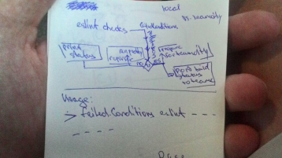
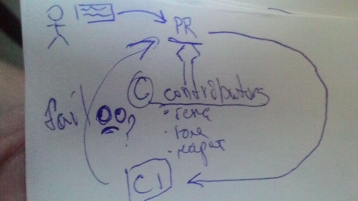
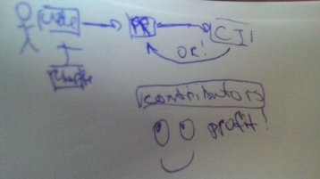

# advanced build conditions
Решение для выставление статусов сборки ct(continues test) на основе дополнительных
проверок, основанных на результатах проверок unit тестов, линтеров и т.д.

---
[]()
[]()
[]()
## Установка
`npm i akaguny/advanced-build-conditions#v.1.0`
### Требования
* NodeJs 8+
* npm5
* linux(желательно)
## Использование
### nodejs module
```
const buildFailedConditions = require('buildFailedConditions');
let config = {eslint: {}, teamcity: {}};
config.eslint = {
  masterJSON: `/home/work/IdeaProjects/eslint-teamcity-failed-conditions/spec/fixtures/error.json`,
  currentJson: `/home/work/IdeaProjects/eslint-teamcity-failed-conditions/spec/fixtures/empty.json`
  resultJSON: '/home/work/IdeaProjects/eslint-teamcity-failed-conditions/spec/fixtures/empty.json'
};
config.teamcity = {
  login: testUsername,
  pass: testPassword,
  host: testHost,
  projectId: testProjectId,
  buildId: testBuildId
};
config.local = false;
console.log(buildFailedConditions(config));
```
## Модули
### Teamcity
Позволяет выставлять взаимодействовать с teamcity по REST и teamcity service messages.

### Eslint
Умеет сравнивать 2 резульата проверок codestyle и выявляет униклаьные

[Подробное описание модулей](./lib/README.md)

### Участие в разработке
PR приветствуются, проверка codestyle и запуск юнит-тестов выполняется автоматически
по PR в репозиторий. Для локального запуска тестов и проверок codestyle необходимо запустить
соответственно `npm test` и `npm codestyle`

## Внимание - известные ограничения
Если в путях присутствуют пробелы, то модуль работать не будет!
  
## Полезные ссылки
* [teamcity test service messages](https://confluence.jetbrains.com/display/TCD10/Build+Script+Interaction+with+TeamCity#BuildScriptInteractionwithTeamCity-Supportedtestservicemessages)
* [eslint-teamcity](https://www.npmjs.com/package/eslint-teamcity)
* [teamcity-service-messages](https://github.com/pifantastic/teamcity-service-messages)
